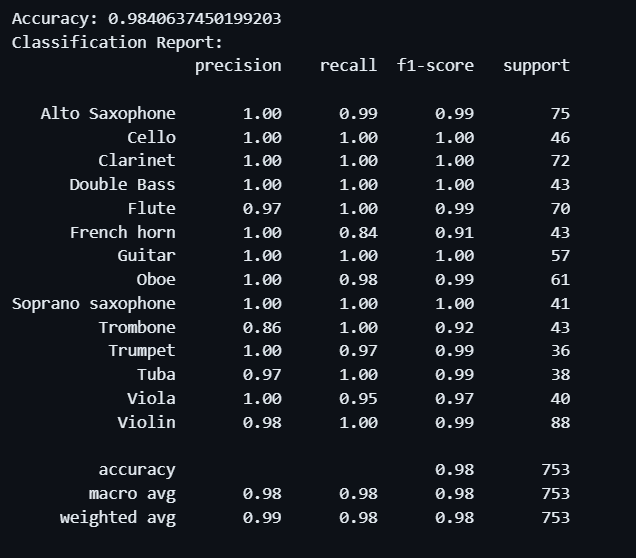

# 🎵 Musical Instrument Identification System

This project is aimed at building a system that can identify musical instruments from audio recordings. The system utilizes machine learning techniques to classify the audio samples into different instrument categories.

## 📖 Overview

The instrument identification system consists of several components:

1. **Data Collection**: Gathering audio recordings of various musical instruments. This dataset will serve as the basis for training our machine learning models.
   - [Kaggle Dataset](https://www.kaggle.com/datasets/dibakarsil/music-instruments-and-2d-figures): This dataset contains a collection of audio recordings and 2D representations of various musical instruments. The ".wav_files" folder contains all the .wav files of different musical instruments.
   - [Zenodo Dataset](https://zenodo.org/records/3685367): TinySOL is a dataset of 2913 samples, each containing a single musical note from one of 14 different instruments. These audio samples will be used for training machine learning models.

2. **Preprocessing**: Since the data obtained from the selected databases (Zenoda and Kaggle Dataset) is already clean and well-curated, no preprocessing steps are required. The audio recordings are ready for feature extraction without the need for resampling, noise reduction, or segmentation.

4. **Feature Extraction**: Extracting relevant features from the audio data, such as Mel Frequency Cepstral Coefficients (MFCCs), Chroma, and Spectral Contrast.  After extraction, each feature set is saved in a CSV file for further  model training.

5. **Model Training**: Training machine learning models  using the extracted features. The trained models will learn to classify audio samples into different instrument categories.

6. **Evaluation**: Evaluating the performance of the trained models using various metrics such as accuracy, precision, recall, and F1 score. The achieved accuracy reached up to 98%.

   

👉For more detailed information, please refer to the [Record.pdf](Record.pdf) document.
